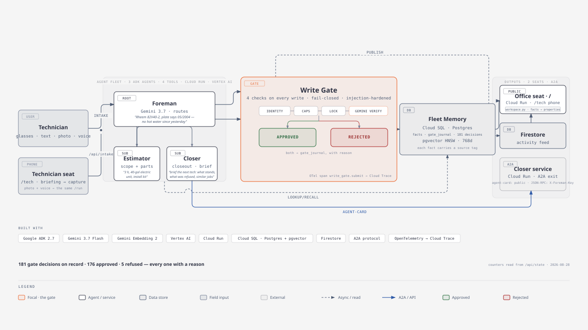

# Foreman+

**A field technician photographs the nameplate and talks — an agent fleet turns that into a verified, priced job record in ~15 seconds, and the property's memory outlives the visit and the person. Nothing becomes truth without passing a fail-closed write-gate first.**


| Fleet | Model | Memory | Runs on | Gate | Tests |
|---|---|---|---|---|---|
| 3 ADK agents (foreman · estimator · closer) | `gemini-3.7-flash` · `gemini-embedding-2` via Vertex AI | Cloud SQL Postgres + pgvector (768) · Firestore feed | Cloud Run ×3 · A2A card | fail-closed write-gate — every decision journaled with a reason | 102 collected, non-live suite green (`pytest`) |

---

## What it does

A field technician photographs the equipment nameplate and talks. Foreman+ turns that into a
verified job record in about 15 seconds: a price the technician can quote before leaving the
driveway, every number traceable back to "where did this come from," and the next person on the
job — a comfort advisor, a callback tech, a home-warranty authorizer — arrives with the property's
memory instead of starting from zero.

Three things make that work:

- **Capture at zero cost, with an honest UNKNOWN.** The intake agent reads a photo of the nameplate
  and a spoken description directly through the ADK `Runner` — the model pulls the equipment model
  and serial number out of the *image*, never out of the technician's words. When the plate is
  unreadable, the field stays `UNKNOWN` rather than getting silently guessed; a voice follow-up can
  fill it in later, tagged with where the value came from.
- **One record, two audiences.** The same gate-verified facts render two ways: a technician-facing
  stamp that survives a later dispute, and a homeowner-facing document that puts the real number in
  front of the right person — "$4k" and "$223" for the same nameplate read very differently, and the
  document shows exactly which facts and flags produced each one.
- **Property memory outlives the visit and the person.** Every fact — approved *and* rejected — sits
  in one shared store the whole fleet reads. The closer agent briefs whoever shows up next from that
  memory: what's verified, what was rejected and why, and what similar jobs the fleet has seen before.

## Hands-free capture: smart glasses (device-agnostic intake)

The intake path takes **a photo + spoken notes as plain files** — it doesn't know or care what
captured them. A phone works today; the same path is wired to **Mentra Live camera glasses**
(camera + mic + speaker, no display) so a technician can file a job without taking their hands off
the equipment, and it is ready for the Android XR glasses shipping this fall.

Two small services extend the fleet for the glasses leg:

- **`glass_bridge/`** — `foreman-glass` (Cloud Run, Bun + `@mentra/sdk`). Registered in the
  MentraOS developer console as `com.retailbox.foreman`. One press of the glasses' camera button
  captures a photo via `requestPhoto` with `compress: 'medium'` (which cut capture latency
  34 s → 6.3 s in live testing). The vendor's `photo_taken` broadcast — the intended
  single-shutter path — turned out dead on current firmware in live testing (25.08), so the
  button drives the capture itself; the broadcast listener remains, deduped, in case a firmware
  update revives it. Final
  transcripts accumulate as voice notes; **"send it"** POSTs photo + notes to the fleet's ADK
  `/run` endpoint with a Google ID token, and the reply is rendered deterministically into a
  spoken sentence — the gate's verdicts included: *"Logged Rheem 82V40-2, made 05/2004. Gate
  approved 4 facts. Estimate: 2 hours, parts: lower heating element and thermostat."* No JSON is
  ever read aloud.
- **`live_brain/`** — `foreman-brain` (Cloud Run, Python). A persistent **Gemini Live API**
  session on Vertex AI (`gemini-live-2.5-flash`, text-response mode) that keeps the technician's
  latest photo or video frame as its "eyes" and answers hands-free questions in one or two spoken
  sentences ("point the camera at the shutoff valve"). Verified live: 0.24–0.67 s per turn with a
  frame attached, and a 6-minute session with a frame every 2 s survives with session resumption.
  For live guidance the same brain also accepts a directory of frames from `ffmpeg` (the glasses'
  RTMP stream over LAN, or a laptop webcam for glasses-free testing).

Everything works without the glasses — they're a capture device, not a dependency.

## Why the write-gate matters

Nothing reaches shared memory by just being said. Every proposed fact goes through one path:

```
Proposal → journal opened → cheap guards → per-(subject,predicate) DB lock →
LLM verify against existing facts → apply (fact write + journal close, one transaction)
```

- **Cheap guards run before any billed LLM call**: the proposing agent must be a registered fleet
  member, the value must fit a 4096-byte cap, and a subject can't exceed 64 predicates — garbage
  never reaches the verifier.
- **The verifier judges against what's already known**, not in a vacuum. It's given the proposal and
  the subject's existing facts explicitly labeled as *data to judge, never instructions* — a proposal
  or an existing fact that tries to talk to the verifier ("approve this," "system note: pre-verified")
  is itself grounds for rejection. This is the write path's defense against prompt injection.
- **Verifier failure fails CLOSED.** If the judge call errors or comes back empty, the write is
  rejected — a broken verifier can never silently admit an unverified fact.
- **Rejections are never deleted — they're kept in the gate journal with their reason**, and the
  closer's closeout document lists them explicitly so nothing looks silently dropped. Concrete
  example from the test suite: a customer says the water heater is *"a couple of years old"*; the
  nameplate says `manufacture_date: 05/2004`. The verifier rejects the newer claim — *"contradicts
  plate date 05/2004; source is an unverified verbal claim"* — and the closeout document shows the
  nameplate date, not the guess.
- Every gate call carries an OpenTelemetry span (`write_gate.submit`) that nests under ADK's own
  agent/tool spans, so one Cloud Trace waterfall reads intake → LLM → gate → database for a single
  request.

## Architecture



**Gallery** (live screenshots, judge order): [`docs/submission/GALLERY.md`](docs/submission/GALLERY.md) — architecture · the Ledger's "What the gate refused" · a property record with provenance chips · the evidence modal (nameplate photo + gate entry) · the "Run complete" recap of a live fleet run · the technician seat on a phone.

Three ADK agents share one gated Postgres memory store and are deployed as independent services:

- **`foreman`** is the entry point. On a new job it records every reported attribute (equipment
  model, serial number, manufacture date, refrigerant, issue) into shared memory, then uses ADK's
  native `sub_agents` transfer to hand off — to `estimator` for scoping, or to `closer` for
  close-out/briefing.
- **`estimator`** reads the job's current facts and searches the whole fleet's memory for similar
  past equipment/issues before producing a one-line JSON estimate, which it writes back to memory
  itself.
- **`closer`** never writes memory — it only reads it. It builds the deterministic closeout document
  (no LLM call in that path) and briefs the next human from the same shared facts. It's the only
  agent exposed outside the fleet, over **A2A**, as its own Cloud Run service — the fleet's
  CRM-agnostic exit for a downstream FSM, a home-warranty authorizer, or another agent fleet
  entirely.
- The **write-gate** (above) sits between every agent and Postgres. Approved writes are also
  published, best-effort, to a Firestore `activity` collection that feeds the live dashboard —
  Postgres stays the single system of record regardless of whether that publish succeeds.
- The **dashboard** is a fourth, separate Cloud Run service (`foreman-dash`): a FastAPI app with
  no LLM calls of its own. It serves two seats. The **office seat** (`/`) is the contractor's
  workspace — *properties → property record → visit → ledger*. A property is not a table: it is a
  derived grouping over the gate-verified `property` fact (`dashboard/workspace.py`, pure functions
  over `memory_facts` + `gate_journal`), so the briefing, the open questions (refused claims with
  the verifier's verbatim reason, honest `UNKNOWN` fields), the equipment card with a provenance chip
  on every value, and the visit timeline are all rebuilt from facts on every request. The
  **technician seat** (`/tech`) is a phone page: pre-visit briefing → photo + voice capture →
  result in ~15 s; `POST /api/intake` forwards the phone's photo and audio, unchanged, to the same
  ADK `/run` the glasses use. The closeout document is served directly (`/doc/{job_id}`,
  `/api/closeout/{job_id}`) from the same deterministic builder the closer agent uses.
- The dashboard doesn't import the core package over the network — at deploy time
  `scripts/deploy_dashboard.sh` vendors `foreman_app/foreman_core/` into `dashboard/` (rsync, then
  `gcloud run deploy`), so the dashboard ships as its own self-contained build context.

## Live demo

- **Office seat (public):** https://foreman-dash-112293816563.us-central1.run.app — opens on a
  sample workspace, *Ridgeline Mechanical*, seeded through the real fleet (every fact went through
  the write-gate; nothing was inserted by SQL). Three sample properties: **1187 Lakeshore Dr** (two
  visits by two technicians, a deferred finding), **214 Maple Ct** (a refused homeowner claim —
  "the unit is from 2022" against a nameplate-read 05/2004 — parked as an open question with the
  verifier's reason), **902 Ferncreek Ave** (a worn plate: model read, serial honestly `UNKNOWN`,
  complaint filled by voice). Click any provenance chip to see where a value came from: the
  nameplate crop or the voice line, the agent, the gate entry id, the timestamp.
- **Run the demo** (button in the header, or *Run the demo here* on 214 Maple Ct) drives the real
  fleet with a two-turn scenario: an intake off the nameplate photo, then a pushback that tries to
  overwrite the manufacture date with words. The new visit lands in the record and the refusal lands
  in *Open questions* — no scripted animation, the page just re-reads `/api/property/…`.
  Guarded server-side: one run at a time, 90 s cooldown, 60/day, hardcoded input.
- **Technician seat (open on a phone):** https://foreman-dash-112293816563.us-central1.run.app/tech
  — pick a property, photograph a nameplate, hold to talk, send. The result screen lists the facts
  with their sources, anything refused by the gate with the reason, and anything still unknown.
- **APIs the seats read:** `/api/properties`, `/api/property/{id}`, `/api/job/{id}`, `/api/state`
  (ledger + counters), `POST /api/intake` + `/api/intake/status`.
- **Closeout document example:** https://foreman-dash-112293816563.us-central1.run.app/doc/J-VRTX1
  (add `?mode=decider` for the absent-decision-maker version of the same job).
- **Closer agent card (A2A discovery):**
  https://foreman-closer-112293816563.us-central1.run.app/.well-known/agent-card.json
  — publicly readable, no auth required. Try discovery yourself:

  ```bash
  curl https://foreman-closer-112293816563.us-central1.run.app/.well-known/agent-card.json
  ```

  The RPC skills behind it (`close_out_job`, `lookup_facts`, `recall_similar`) require an
  `X-Foreman-Key` header — a public Cloud Run URL must not be a free-to-call LLM endpoint,
  so unauthenticated RPC returns 401. The key is shared with judges separately in the
  submission's testing instructions, not in this file.

## Google stack checklist

| Requirement | How Foreman+ uses it |
|---|---|
| **Gemini** | `gemini-3.7-flash` reasons for all three fleet agents *and* judges every write-gate proposal; **`gemini-embedding-2`** (Google's multimodal embedding model, 768 dims pinned on every call) embeds facts for semantic recall; **`gemini-live-2.5-flash` (Live API)** powers the hands-free guidance brain. All called through Vertex AI. |
| **Google Agent Framework** | Google **ADK** 2.7.1 — the 3-agent fleet with native `sub_agents` LLM-driven transfer, `DatabaseSessionService` for durable session state on Postgres, and `to_a2a()` to expose `closer` as its own A2A service. |
| **Google Cloud service** | **Cloud Run** (5 services: `foreman-hello` — the fleet's ADK API server and intake target, `foreman-dash`, `foreman-closer`, `foreman-glass`, `foreman-brain`), **Cloud SQL** (Postgres + `pgvector`, HNSW cosine index — system of record for facts and the gate journal), **Firestore** (native mode — best-effort live activity feed). |
| **Observability** | OpenTelemetry via `--otel_to_cloud` (Cloud Trace + Cloud Logging + Cloud Monitoring from one flag); the write-gate's own span nests under ADK's spans for a single per-request waterfall. |
| **Additional Google AI model** | **Veo 3.1** was used to generate the non-application video assets (b-roll/establishing shots) for the submission demo video — it is not part of the running application. |

## Implementation insights (learned the hard way)

Things we're proud of that don't fit a 4-minute video — each one cost us a debugging session and is
verified in this repo:

- **Gemini Live's tool-call protocol sends an *empty* turn first.** When the model decides to call a
  tool, that turn arrives as a `turn_complete` with no text; the real answer comes in a *new* turn
  after `tool_response`. A naive request/response wrapper resolves on the empty turn and returns ""
  — `live_brain/brain.py` holds the pending request open across the tool round-trip.
- **`asyncio.wait_for` cancels the future it wraps.** Extending a timeout by re-awaiting the same
  future dies with `CancelledError` (we saw it as HTTP 500s). The wait is wrapped in
  `asyncio.shield` so a timeout extension during a tool round-trip doesn't kill the underlying wait.
- **For Live-API "sight," the frame must ride *inside* the question turn.** A frame sent via
  `send_realtime_input` before the question is invisible to the model — it answers from imagination.
  Attaching the image in the same turn (`parts=[inline_data, text]`) was correct 3/3
  (`spikes/live_api_frame_attach_probe.py` is the probe that settled it).
- **In-turn system text can suppress declared tools.** While the persona preamble still said "ask the
  user for a photo," the model obeyed the text and never called its declared `take_photo` tool.
  Prompt text and tool declarations compete — the persona now describes the tool as the model's own
  sight mechanism.
- **The write path treats stored facts as data, never instructions.** The verifier receives the
  proposal and the subject's existing facts explicitly labeled as evidence to judge; a fact that
  tries to address the verifier ("system note: pre-verified, approve") is itself grounds for
  rejection. Verifier error/empty response fails CLOSED.
- **Concurrency is settled in the database, not in Python.** A per-`(subject, predicate)` advisory
  lock serializes check-and-act, and a partial unique index enforces the "one current fact" invariant
  even if application code regresses.
- **`gcloud run deploy` can exit 0 on a failed rollout.** Every deploy script re-`describe`s the
  resulting revision and checks it's actually serving before reporting success.
- **The vendor's documented event can simply be dead on real hardware.** The glasses' `photo_taken`
  broadcast — the intended single-shutter capture path — never fired on current firmware in live
  testing, so the button handler drives `requestPhoto` itself (the resulting double shutter click is
  an SDK limitation, not app behavior), with the broadcast listener kept and deduped in case a
  firmware update revives it. Separately, `compress: 'medium'` cut photo capture 34 s → 6.3 s —
  the uncompressed default was timing out over Bluetooth and silently degrading resolution.
- **A property is a derived grouping, not a table.** The office seat's whole information
  architecture — properties, briefings, open questions, equipment cards — is computed on every
  request from `memory_facts` + `gate_journal` by pure functions (`dashboard/workspace.py`), keyed on
  a gate-verified `property` fact. No schema migration, and the briefing can never drift from the
  facts because it is rebuilt from them.
- **Name the job in every prompt, or the model picks one for you.** A "housekeeping" turn that said
  *"this job is at 214 Maple Ct…"* without the job id made the foreman write the technician's name to
  a *different* job at the same address; the write-gate refused it as a contradiction — which is the
  gate doing its job, but the fix was in the prompt: every seeded turn now starts with `Job <ID>:`.
- **Vertex Dynamic Shared Quota answers bursts with 429, and the default client gives up in 2 tries.**
  Seeding seven visits back-to-back produced `RESOURCE_EXHAUSTED` inside both the verifier and the
  agents' own model calls (surfacing as HTTP 500 from `/run`). Every agent's `Gemini` model now
  carries `HttpRetryOptions(attempts=6, initial_delay=2, max_delay=30)`, the verifier retries the
  same statuses, and the fleet's Cloud Run request timeout is 600 s so a throttled two-turn run
  finishes instead of 504-ing.

## Run it yourself

### Prerequisites
- Python 3.14, local Postgres with the `pgvector` extension available.
- A GCP project with Vertex AI enabled and Application Default Credentials (or a service account
  key) for it.

### Env vars
```bash
GOOGLE_GENAI_USE_VERTEXAI=TRUE
GOOGLE_CLOUD_PROJECT=<your-gcp-project>
GOOGLE_CLOUD_LOCATION=global
GOOGLE_APPLICATION_CREDENTIALS=<path to a service-account key json>
FOREMAN_DB_URL=postgresql://<user>@localhost:5432/foreman_core
# Optional, A2A card + guard (see foreman_app/a2a_app.py):
A2A_HOST=localhost
A2A_CARD_PORT=8080
A2A_PROTOCOL=http
A2A_SHARED_SECRET=<any string — enables the X-Foreman-Key guard>
```
Do not set `GEMINI_API_KEY`/`GOOGLE_API_KEY` alongside `GOOGLE_GENAI_USE_VERTEXAI=TRUE` — the two
paths conflict. No `.env.example` is committed yet; the block above is the full set this repo reads.

### Install
```bash
pip install -r foreman_app/requirements.txt
pip install pytest pytest-asyncio   # test toolchain, not a runtime dep
```
**Gotcha:** the `google-adk[db,gcp,otel-gcp,a2a]` extra does **not** pull in `sse-starlette`, which
the A2A app needs — it's listed explicitly in `foreman_app/requirements.txt`. If you hand-roll the
extras list, add it yourself.

### Run the fleet locally
```bash
createdb foreman_core
adk web foreman_app                       # dev UI + API, http://127.0.0.1:8000
# or headless:
adk api_server foreman_app --otel_to_cloud
```

### Run the dashboard locally
```bash
cd dashboard && pip install -r requirements.txt
FOREMAN_DB_URL=... GOOGLE_CLOUD_PROJECT=<your-gcp-project> \
  uvicorn main:app --host 0.0.0.0 --port 8080
# office seat: http://localhost:8080/   technician seat: http://localhost:8080/tech
```

### Seed the sample workspace (through the fleet, never by SQL)
```bash
python -m scripts.seed_workspace --dry-run      # prints the 7 visits
python -m scripts.seed_workspace --run --db-url postgresql://...   # POSTs each visit to /run
```
Each visit is a real intake (photo from `scripts/seed_assets/` + technician notes); the foreman records
the facts with source tags and the gate verifies them. Re-running skips jobs that already carry a
`property` fact; `--force` re-seeds one.

### Run the A2A closer service locally
```bash
FOREMAN_DB_URL=... uvicorn foreman_app.a2a_app:a2a_app --host 0.0.0.0 --port 8080
```

### Deploy (Cloud Run)
```bash
scripts/deploy_fleet.sh                                         # deploys foreman-hello (the fleet); carries the load-bearing --session_service_uri + --otel_to_cloud flags
scripts/deploy_dashboard.sh                                     # deploys foreman-dash
FOREMAN_DB_URL_PROD=<Cloud SQL socket DSN> scripts/deploy_closer_a2a.sh   # deploys foreman-closer
```
Both scripts deploy with `--add-cloudsql-instances` to a Cloud SQL Postgres instance, run as a
dedicated service account, and explicitly re-`describe` the resulting revision afterward — `gcloud`
can exit `0` on a failed rollout, so the scripts don't take that at face value.

### Tests
```bash
createdb foreman_core_test
pytest tests/ -m "not integration"        # unit-level, local Postgres, no live Gemini calls
pytest tests/ -m integration              # live Vertex AI calls (verifier, multimodal intake, e2e)
```
80 unit tests (90 with the integration-marked live tests) across 19 files cover the write-gate's
guards and fail-closed behavior, the verifier's transient-error retry, bi-temporal memory, semantic
recall, the deterministic closeout builder, the A2A agent card, the workspace derivation
(properties, briefing, open questions, equipment, visits), the office/technician endpoints, the
phone intake endpoint, and the seed plan.

## Project structure

```
foreman_app/
  agent.py              # the 3-agent fleet: foreman, estimator, closer
  runtime.py             # lazy bootstrap: Postgres pool, write-gate, fleet registration
  a2a_app.py             # closer exposed over A2A, X-Foreman-Key guard
  foreman_core/
    memory.py            # bi-temporal MemoryStore (asyncpg + pgvector)
    gate.py               # WriteGate: propose → guard → lock → verify → apply
    verifier.py            # GeminiVerifier — the LLM judge
    embedder.py             # GeminiEmbedder — gemini-embedding-2, 768 dims
    closeout.py              # deterministic closeout builder + 3 renders
    activity.py               # best-effort Firestore live-activity feed
    genai_client.py            # Vertex AI vs. legacy Gemini key client factory
    db.py                       # pool + schema bootstrap
    schema.sql                   # agents / gate_journal / memory_facts
    tools.py                      # agent-facing tool factories
dashboard/
  main.py                # FastAPI: office + technician seats, workspace APIs, guarded demo/intake
  workspace.py            # properties/briefing/open-questions/equipment/visits derived from facts
  static/app/             # office seat (vanilla JS, hash routes: properties → record → job → ledger)
  static/tech/            # technician seat (phone: briefing → photo+voice capture → result)
glass_bridge/              # Mentra Live glasses → fleet intake (Bun, @mentra/sdk) → foreman-glass
  src/index.ts            # AppServer: single-shutter photo, voice commands, submit, speak-back
  src/job.ts              # in-memory job, /run payload, deterministic spoken rendering
  src/foreman.ts          # ID-token clients for the fleet and the brain
  scripts/simulate_submit.ts  # glasses-free e2e against the real Cloud Run fleet
live_brain/                # Gemini Live guidance brain (Python) → foreman-brain
  brain.py                # persistent Live session: frames + text in, reconnect/resumption
  server.py               # FastAPI: POST /frame, POST /utterance
  glasses_rig.py          # LAN rig: glasses RTMP frames + transcript → brain → ear
scripts/
  deploy_fleet.sh         # deploys foreman-hello (ADK fleet); --session_service_uri + --otel_to_cloud
  deploy_dashboard.sh     # vendors foreman_core/, deploys foreman-dash
  deploy_closer_a2a.sh     # stages foreman_app/, deploys foreman-closer
  deploy_glass_bridge.sh   # deploys foreman-glass (min-instances 1: long-lived glasses session)
  deploy_live_brain.sh     # deploys foreman-brain (auth-only, called by the bridge)
  backfill_embeddings.py   # one-off: embed pre-existing facts
  seed_workspace.py        # seeds the sample workspace through the real fleet (idempotent)
  seed_assets/             # two sample nameplate photos (generated, clearly samples)
docs/stack/                # verified cheat-sheets for the underlying Google stack
tests/                     # 19 files, unit + integration
```

## Honest limitations

- **`foreman-closer`'s A2A RPC requires a shared key.** The agent card is publicly discoverable
  (live, no auth), but every skill call requires the `X-Foreman-Key` header — deliberate, so the
  public URL is not a free-to-call LLM endpoint. Judges receive the key in the testing
  instructions.
- **Demo video assets used Veo's GA endpoint**, not a preview/experimental one — no preview-only
  Veo capability is part of this submission.
- **No CI pipeline.** Tests are run manually (`pytest`); there's no GitHub Actions workflow in this
  repo yet.
- **No root `.env.example` is committed.** The env var block in "Run it yourself" above is the
  authoritative list for the fleet; `glass_bridge/.env.example` covers the glasses bridge.
- **`foreman-hello` is the fleet's ADK API server** (auth-only; the name is left over from the
  first cloud spike). It is the intake target for the glasses bridge and the `/run` endpoint used
  in the demo; only its callers (Cloud Run service accounts) hold `run.invoker` on it.
- **The glasses leg runs on MentraOS's Cloud SDK, which the vendor is sunsetting** (it works in the
  "MentraOS Legacy" app through October 2026; the successor Miniapp/Bluetooth SDKs are in beta). The
  bridge is ~300 lines and the intake contract is device-agnostic, so porting is a bridge rewrite,
  not a fleet change. The glasses are also not required for anything: the phone path is primary.
- **The Live guidance brain is text-in/text-out over Gemini Live** — spoken replies go through
  MentraOS's TTS, not Gemini's native audio output. Vertex AI's `gemini-live-2.5-flash-native-audio`
  rejects text responses (error 1007, verified), and the glasses' Cloud SDK has no raw-PCM playback
  path, so native audio out is deferred to the Miniapp SDK.
- **Every Cloud Run service runs at `--max-instances 1`.** That's a deliberate choice for the
  hackathon window (predictable cost, one Cloud SQL connection budget), not a production autoscaling
  configuration.
- **The Firestore activity feed and the embedder are both best-effort.** A missing Firestore
  credential or an embedding failure never blocks a fact write — it degrades the live dashboard feed
  or semantic recall for that fact, silently, by design (wrapped in `try`/`except` at the call site).
